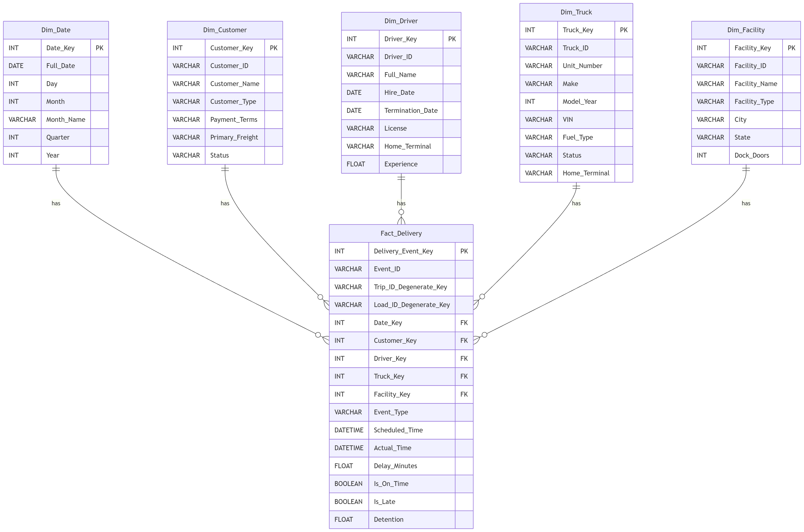
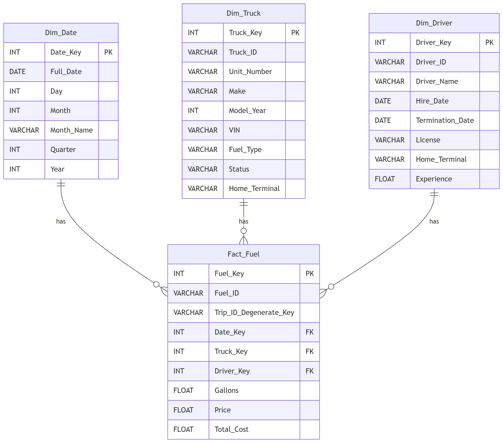
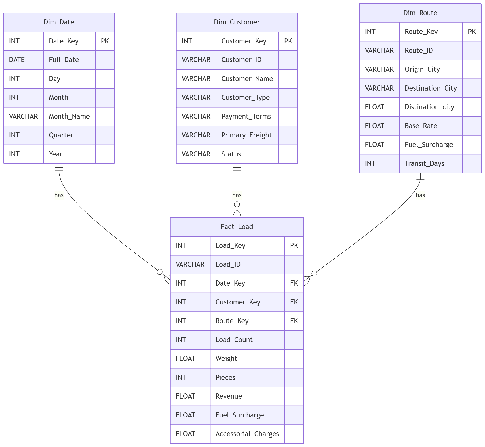
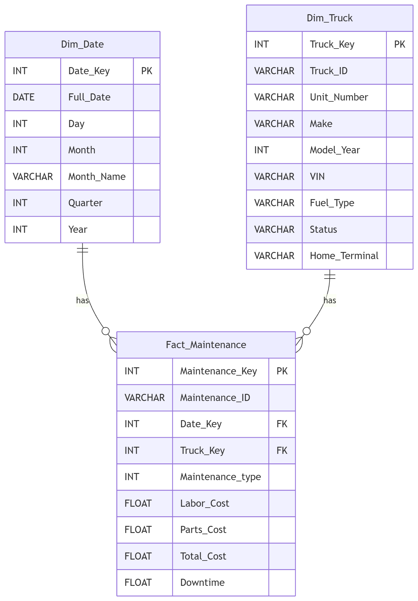
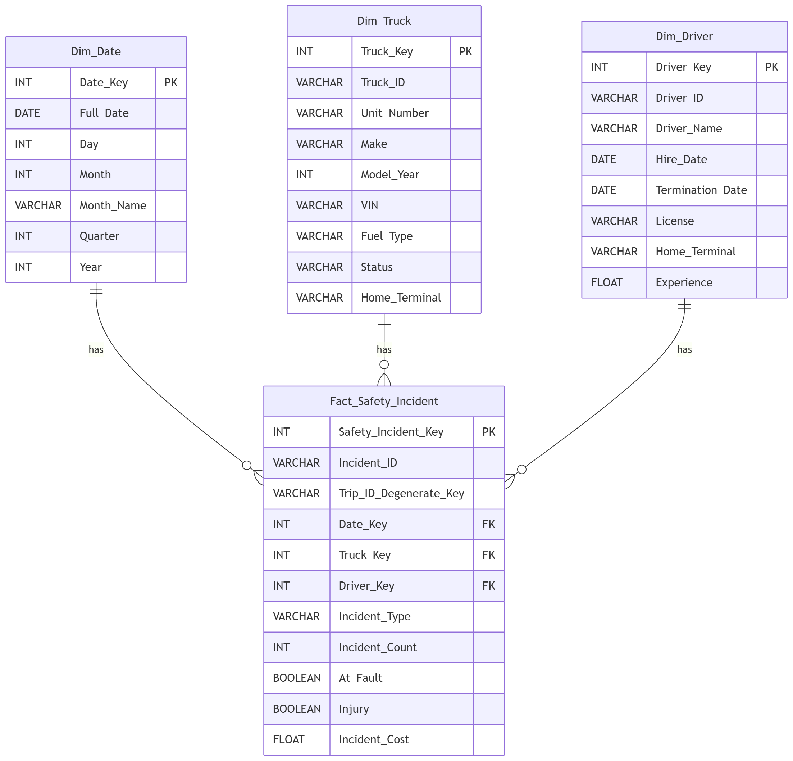
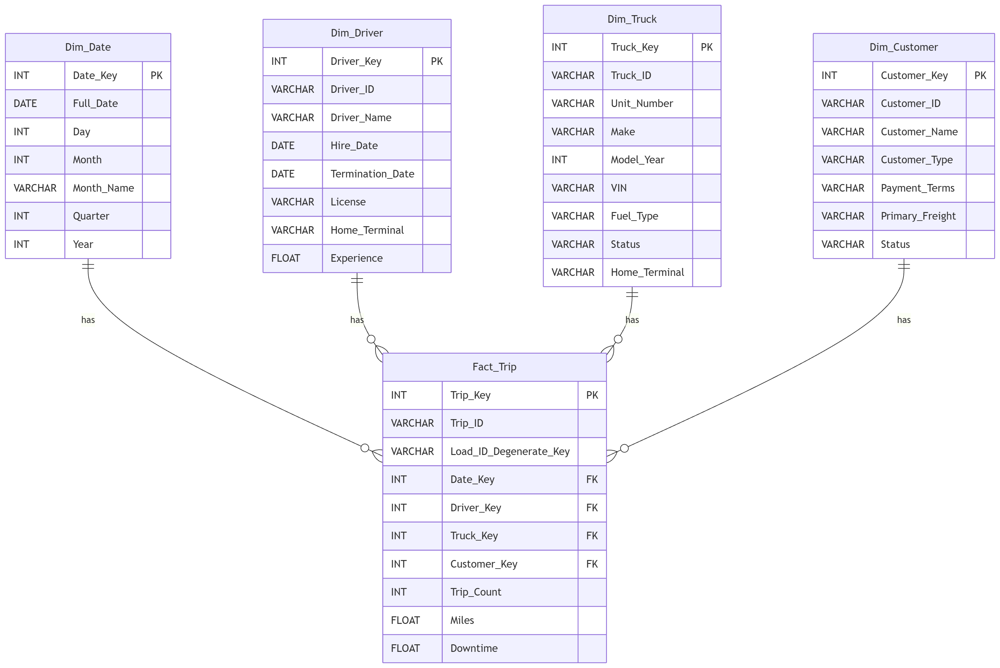

# DW_MiniProject
for do midterm project

# Introduce our group
Nattida Jantasopa 673020044-1

Chutima Boottanai 673020248-5

Jinrada Sai-Udta 673020489-3

Nanadda Rattanasri 673020490-8

Thitisuda Daengseeda 673020491-6

Phlapapon Kulto 673020626-9

## 🏗 Architecture & Design Principles

การออกแบบสถาปัตยกรรมข้อมูลในโปรเจกต์นี้ปฏิบัติตามมาตรฐาน **Kimball Data Warehousing Methodology**:

1. **Strict Star Schema Boundaries:** แยกตารางอย่างเด็ดขาดระหว่าง **Dimension Tables** และ **Fact Tables**
2. **No Fact-to-Fact Joins:** ป้องกันปัญหา *Fan Trap* และ *Double Counting* โดยยกเลิกการเชื่อมต่อความสัมพันธ์ระหว่าง Fact Tables โดยตรง แต่เชื่อมโยงผ่าน Shared (Conformed) Dimensions แทน
3. **Degenerate Dimensions:** คงค่ารหัสธุรกรรม เช่น `Trip_ID` และ `Load_ID` ไว้ใน Fact Tables เป็น Degenerate Keys เพื่อประโยชน์ในการ Traceability และ Drill-through Analysis
4. **Conformed Dimensions:** ใช้ `Dim_Date`, `Dim_Truck`, `Dim_Driver`, และ `Dim_Customer` ร่วมกันในหลาย Fact Tables เพื่อให้วิเคราะห์ข้อมูลข้ามโดเมนได้ (เช่น เปรียบเทียบรายได้ ค่าน้ำมัน และอุบัติเหตุต่อ Truck/Driver)

---
## Business Questions
1. รายได้รวมของบริษัทในแต่ละปีมีแนวโน้มอย่างไร และธุรกิจเติบโตขึ้นหรือไม่
2. เดือนหรือช่วงเวลาใดสร้างรายได้สูงที่สุด 
3. ลูกค้ารายใดสร้างรายได้ให้บริษัทมากที่สุด
4. เส้นทางใดมีปริมาณงานสูงที่สุด
5. รถบรรทุกคันใดมีประสิทธิภาพการใช้งานสูงสุดที่สุดและต่ำที่สุด เมื่อพิจารณาจากระยะทาง จำนวนเที่ยว และเวลาที่ใช้งาน
6. คนขับคนใดมีประสิทธิภาพในการทำงานสูงที่สุด เมื่อพิจารณาจากจำนวนเที่ยว ระยะทาง การส่งตรงเวลา และรายได้ที่สร้าง
7. ต้นทุนน้ำมันของบริษัทในแต่ละเดือนและแต่ละปีเป็นอย่างไร
8. รถบรรทุกคันใดมีค่าใช้จ่ายค่าน้ำมันมากที่สุด
9. รถบรรทุกคันใดมีค่าใช้จ่ายในการซ่อมบำรุงสูงที่สุด
10. ค่าใช้จ่ายในการซ่อมบำรุงรวมของบริษัทในแต่ละปีเป็นเท่าไร
11. บริษัทมีอัตราการส่งสินค้าตรงเวลา คิดเป็นกี่เปอร์เซ็นต์
12. ศูนย์กระขายสินค้าใดมีจำนวนการส่งสินค้าล่าช้ามากที่สุด
13. ปีใดมีจำนวน Safety Incident มากที่สุด
14. คนขับรถคนใดเกิดอุบัติเหตุบ่อยที่สุด
15. Safety Incident ประเภทใดเกิดขึ้นบ่อยที่สุด
    

## Data Model Diagram

### ตารางระบบการทำธุรกรรมขนส่งและโลจิสติกส์ (OLTP)
Customers - ข้อมูลลูกค้าที่ใช้บริการขนส่งสินค้า

Loads - รายละเอียดภาระงานหรือรายการสินค้าที่ต้องทำการขนส่งในแต่ละรอบ

Routes - ข้อมูลเส้นทางการขนส่ง รวมถึงเมืองต้นทาง เมืองปลายทาง และระยะทาง

Trips - รายละเอียดการเที่ยววิ่งรถแต่ละครั้งเพื่อทำการจัดส่งสินค้า

Drivers - ข้อมูลประวัติและรายละเอียดของพนักงานขับรถ

Trucks - ข้อมูลรถบรรทุกที่ใช้ในระบบการขนส่ง

Trailers - ข้อมูลหางลากหรือส่วนพ่วงที่ใช้งานร่วมกับรถบรรทุก

Facilities - ข้อมูลศูนย์กระจายสินค้า สถานที่จัดส่ง หรือคลังสินค้า

Delivery_Events - บันทึกเหตุการณ์และสถานะต่างๆ ที่เกิดขึ้นในระหว่างขั้นตอนการจัดส่ง

Fuel_purchases - ประวัติการซื้อหรือเติมน้ำมันเชื้อเพลิงของรถบรรทุก

Safety_incidents - รายงานอุบัติเหตุหรือเหตุการณ์เกี่ยวกับความปลอดภัยที่เกิดขึ้นระหว่างการเดินทาง

Maintainance_record - บันทึกประวัติการซ่อมบำรุงและดูแลรักษารถบรรทุก

Driver_monthly_metrics - ข้อมูลสรุปตัววัดผลและประสิทธิภาพการทำงานรายเดือนของพนักงานขับรถ

Truck_utilization_metrics - ข้อมูลสรุปตัวเลขการใช้งานและประสิทธิภาพของรถบรรทุกรายเดือน
### รายละเอียดชุดข้อมูล 
ชุดข้อมูล Logistics Operations Database (2022–2024) บน Kaggle เป็นฐานข้อมูลจำลองการทำงานจริงของบริษัทรถบรรทุกขนาดใหญ่ (Class 8) ในสหรัฐฯ ครอบคลุมระยะเวลา 3 ปี รวมกว่า 85,000 ระเบียนใน 14 ตารางที่เชื่อมโยงกัน ออกแบบจากประสบการณ์จริง 12 ปีในสายงานโลจิสติกส์ เพื่อแก้ปัญหาความขาดแคลนชุดข้อมูลที่ซับซ้อนสมจริงโดยไม่ติดปัญหาความลับทางธุรกิจ (NDA)
### รายละเอียดข้อมูล 14 ตาราง 
1. กลุ่มข้อมูลหลักและทรัพยากร (Master & Entity Data) เก็บข้อมูลพื้นฐานของทรัพย์สิน บุคลากร ลูกค้า และเส้นทาง เพื่อใช้อ้างอิงในกิจกรรมอื่นๆ
#### Customers (ข้อมูลลูกค้า/ผู้ว่าจ้าง)

`Customer_id`: รหัสลูกค้า (PK)

`Customer_name` / `Customer_type`: ชื่อลูกค้า และประเภทธุรกิจลูกค้า

`Credit_terms_days`: ระยะเวลาเครดิตเทอมชำระเงิน (วัน)

`Primary_freight_type`: ประเภทสินค้าหลักที่ว่าจ้างขนส่ง

`Account_status`: สถานะบัญชีลูกค้า (เช่น Active, Inactive)

`Contract_starts_date`: วันเริ่มสัญญา

`Annual_revenue_potential`: ประมาณการรายได้ต่อปีจากลูกค้ารายนี้

#### Facilities (ศูนย์กระจายสินค้า/คลังสินค้า)
`Facility_id`: รหัสสถานที่ (PK)

`Facility_name`: ชื่อศูนย์/คลังสินค้า

`City / State`: เมือง และรัฐที่ตั้ง

`Latitude / Longitude`: พิกัดภูมิศาสตร์

`Dock_doors`: จำนวนช่องโหลดสินค้า

`Operating_hours`: เวลาทำการ

#### Routes (เส้นทางขนส่งมาตรฐาน)
`Route_id`: รหัสเส้นทาง (PK)

`Origin_city / Origin_state`: เมืองและรัฐต้นทาง

`Destination_city / Destination_state`: เมืองและรัฐปลายทาง

`Typical_distance_miles`: ระยะทางมาตรฐาน (ไมล์)

`Base_rate_per_mile`: ค่าบริการพื้นฐานต่อไมล์

`Fuel_surcharge_rate`: อัตราค่าธรรมเนียมน้ำมันผันแปร

`Typical_transit_days`: ระยะเวลาเดินทางมาตรฐาน (วัน)

#### Drivers (ข้อมูลพนักงานขับรถ)
`Driver_id`: รหัสพนักงานขับรถ (PK)

`First_name / Last_name`: ชื่อ-นามสกุล

`Hire_date / Termination_date`: วันเข้าทำงาน และวันออก (ถ้ามี)

`License_number / License_state`: เลขใบขับขี่ และรัฐที่ออกใบอนุญาต

`Date_of_birth`: วันเกิด

`Home_terminal`: ศูนย์ปฏิบัติการหลักที่สังกัด

`Employment_status`: สถานะการทำงาน

#### Trucks (ข้อมูลรถบรรทุก)
`Truck_id`: รหัสรถบรรทุก (PK)

`Unit_number`: หมายเลขประจำรถ

`Make / Model_year`: ยี่ห้อ และปีที่ผลิต

`Vin`: เลขตัวรถ (Vehicle Identification Number)

`Acquisition_date / Acquisition_mileage`: วันที่จัดซื้อ และเลขไมล์ ณ วันซื้อ

`Fuel_type / Tank_capacity_gallons`: ประเภทน้ำมัน และความจุถังน้ำมัน (แกลลอน)

`Status`: สถานะรถ (เช่น พร้อมใช้งาน, ซ่อมบำรุง)

#### Trailers (ข้อมูลหางลาก/ตู้พ่วง)
`Trailer_id`: รหัสหางลาก (PK)

`Trailer_number / Trailer_type`: หมายเลขหางลาก และประเภทตู้ (เช่น Dry Van, Reefer)

`Length_feet`: ความยาวตู้ (ฟุต)

`Model_year / Vin`: ปีที่ผลิต และเลขตัวถัง

`Acquisition_date`: วันที่จัดซื้อ

`Status / Current_location`: สถานะใช้งาน และสถานที่อยู่ปัจจุบัน

### 3. กลุ่มรายการปฏิบัติการและค่าใช้จ่าย (Transactional Data) บันทึกเหตุการณ์ที่เกิดขึ้นจริงในการทำงานแต่ละวัน
#### Loads (ใบสั่งงาน/ภาระสินค้า)
`Load_id`: รหัสใบสั่งงาน (PK)

`Load_date`: วันที่รับออเดอร์

`Load_type`: ประเภทการบรรทุก (เช่น Full Truckload - FTL)

`Weight_lbs / Pieces`: น้ำหนัก (ปอนด์) และจำนวนชิ้นสินค้า

`Revenue / Fuel_surcharge / Accessorial_charges`: ค่าขนส่งหลัก, ค่าธรรมเนียมน้ำมัน, และค่าบริการเพิ่มเติม

#### Trips (เที่ยววิ่งจริง)
`Trip_id`: รหัสเที่ยววิ่ง (PK)

`Dispatch_date`: วันที่ปล่อยรถออกปฏิบัติงาน

`Actual_distance_miles / Actual_duration_hours`: ระยะทางจริง (ไมล์) และเวลาที่ใช้จริง (ชั่วโมง)

`Fuel_gallons_used / Average_mpg`: ปริมาณน้ำมันที่ใช้ และอัตราสิ้นเปลืองเฉลี่ย (ไมล์/แกลลอน)

`Idle_time_hours`: เวลาที่จอดสตาร์ทเครื่องทิ้งไว้

`Trip_status`: สถานะเที่ยววิ่ง (เช่น Completed, In Transit)

#### Delivery_events (สถานะจุดรับ-ส่งสินค้า)
`Event_id`: รหัสเหตุการณ์ (PK)

`Event_type`: ประเภทเหตุการณ์ (เช่น Pickup, Delivery)

`Scheduled_datetime / Actual_datetime`: เวลาที่นัดหมาย และเวลาที่ไปถึงจริง

`Detention_minutes`: เวลาที่ต้องรอคอย ณ จุดรับส่ง (นาที)

`On_time_flag`: ตัวชี้วัดการตรงต่อเวลา (Yes/No)

`Location_cit`y: เมืองที่เกิดเหตุการณ์

#### Fuel_purchases (ประวัติการเติมน้ำมัน)
`Fuel_purchases_id`: รหัสการซื้อน้ำมัน (PK)

`Purchase_date`: วันที่ซื้อ

`Location_city / Location_state`: สถานีบริการน้ำมัน (เมือง/รัฐ)

`Gallons / Price_per_gallons`: จำนวนแกลลอน และราคาต่อแกลลอน

`Total_cost`: ค่าใช้จ่ายน้ำมันรวม

`Maintenance_records`: (ประวัติการซ่อมบำรุง)

`Maintenance_id`: รหัสการซ่อมบำรุง (PK)

`Maintenance_date / Maintenance_type`: วันที่ซ่อม และประเภทการซ่อม (เช่น สี่งซ่อมตามระยะ Preventive, ซ่อมฉุกเฉิน)

`Odometer_reading`: เลขไมล์ขณะเข้าซ่อม

`Labor_hours / Labor_cost / Parts_cost / Total_cost`: ชั่วโมงแรงงานช่าง, ค่าแรง, ค่าอะไหล่ และราคารวม

`Facility_location`: สถานที่ซ่อมบำรุง

#### Safety_incidents (บันทึกอุบัติเหตุและความเสี่ยง)
`Incident_id`: รหัสเหตุการณ์อุบัติเหตุ (PK)

`Incident_date / Incident_type`: วันที่เกิดเหตุ และประเภทอุบัติเหตุ

`Location_city`: เมืองที่เกิดเหตุ

`At_fault_flag`: ตัวระบุความผิด (ใช่/ไม่ใช่)

`Injury_flag`: ตัวระบุการบาดเจ็บ (มี/ไม่มี)

### 4. กลุ่มข้อมูลสรุปตัววัดผล (Aggregated Analytics Data) ตารางคำนวณสรุปรายเดือนเพื่อใช้ทำ KPI แดชบอร์ด และรายงานผู้บริหาร
`Driver_monthly_metrics` (สรุปผลงานคนขับรายเดือน)

`Driver_id + Month`: รหัสพนักงาน และเดือนที่สรุป (Composite Keys)

`Trips_completed / Total_miles`: จำนวนเที่ยววิ่งที่สำเร็จ และระยะทางรวม

`Total_revenue`: รายได้รวมที่คนขับทำได้

`Average_mpg / Total_fuel_gallons`: ประสิทธิภาพประหยัดน้ำมันเฉลี่ย และปริมาณน้ำมันรวม

`On_time_delivery_rate`: อัตราการส่งสินค้าตรงเวลา (%)

`Average_idle_hours`: เวลาจอดติดเครื่องเฉลี่ย

#### Truck_utilization_metrics (สรุปการใช้งานรถบรรทุกรายเดือน)
`Truck_id + Month`: รหัสรถบรรทุก และเดือนที่สรุป (Composite Keys)

`Trips_completed / Total_miles / Total_revenue`: งานรวม, ระยะทางรวม, รายได้รวมของรถคันนั้น

`Average_mpg`: อัตราสิ้นเปลืองน้ำมันเฉลี่ยของรถ

`Maintenance_events / Maintenance_cost`: จำนวนครั้งเข้าซ่อม และค่าซ่อมบำรุงรวม

`Downtime_hours`: จำนวนชั่วโมงที่รถต้องจอดซ่อม (ใช้งานไม่ได้)

`Utilization_rate`: อัตราการถูกนำไปใช้งานจริงเทียบกับเวลาทั้งหมด (%)

### การดำเนินงานของธุรกิจ Logistics
Step 1: ตั้งต้นจากลูกค้าและการจองงาน (Demand Generation)
เริ่มที่ Customers สั่งงานเกิดเป็น Loads ผ่าน Routes และ Facilities

Step 2: การจัดสรรทรัพยากร (Execution Setup)
อธิบายว่า Loads ถูกแปลงเป็น Trips โดยจับคู่ทรัพยากร 3 อย่างเข้าด้วยกันคือ Drivers + Trucks + Trailers

Step 3: บันทึกเหตุการณ์ระหว่างทาง (Operational Events & Expenses)
การวิ่งรถสร้างข้อมูล 3 ด้าน: เวลาจัดส่ง (Delivery Events), ต้นทุนผันแปร (Fuel Purchases), และความเสี่ยง (Maintenance Records & Safety Incidents)

Step 4: การวัดผลทางธุรกิจ (Business Intelligence Output)
สรุปข้อมูลธุรกรรมทั้งหมดกลับมาเป็น Driver Monthly Metrics และ Truck Utilization Metrics เพื่อตอบโจทย์บริหาร เช่น การวัด Fleet Utilization (เฉลี่ย 65%) หรือ Driver Turnover Rate (15%)

## ETL Process
กระบวนการ ETL ในโปรเจกต์นี้ใช้ dbt เป็นหลักในการประมวลผลบน DuckDB เพื่อแปลงข้อมูลดิบจากการขนส่งให้เป็น Data Warehouse รูปแบบ Star Schema โดยแบ่งขั้นตอนอย่างละเอียดดังนี้
### Step 1: Extract (การสกัดและนำเข้าข้อมูลดิบ)
Ingestion: ดึงข้อมูลดิบเชิงการดำเนินงาน (Operational Data) จากไฟล์ CSV ต้นทาง เช่น fuel_purchases.csv, drivers.csv, trips.csv เข้าสู่ DuckDB โดยตรงในลักษณะ Raw Tables

Data Lineage Integration: ในขั้นตอนแรกจะไม่มีการเปลี่ยนโครงสร้างข้อมูลต้นฉบับ แต่จะเพิ่มคอลัมน์ Metadata สำหรับการติดตามร่องรอยข้อมูล (Audit Columns) เข้าไปใน CTE raw_data:

- stg_loads_at: บันทึกเวลาที่นำข้อมูลเข้าด้วย CURRENT_TIMESTAMP
  
- source_filename: บันทึกชื่อไฟล์ต้นทาง
  
- batch_id: บันทึกรหัสรอบของการประมวลผลข้อมูล (เช่น BATCH_2026)
  
### Step 2: Transform - (Staging Layer: stg_)
การประมวลผลใน Staging Layer เน้นการทำความสะอาดข้อมูลแบบ 1 ต่อ 1 ก่อนนำไปใช้งานต่อ ผ่าน 3 กระบวนการย่อย:

- Text Standardization: ตัดช่องว่างด้วย TRIM() และปรับตัวอักษรเป็นพิมพ์ใหญ่ด้วย UPPER() บนคอลัมน์ที่เป็น Business Keys เช่น driver_id, truck_id, trip_id เพื่อป้องกันปัญหาคีย์ไม่จับคู่กันเนื่องจากเว้นวรรคหรือตัวพิมพ์ต่างกัน
  
- Safe Type Casting & Null Handling:
  
  ใช้ TRY_CAST() แปลง Data Type อย่างปลอดภัย เช่น แปลงวันที่ด้วย TRY_CAST(purchase_date AS DATE) หากมีข้อมูลผิดปกติระบบจะคืนค่าเป็น NULL แทนการรันล้มเหลว

  ใช้ NULLIF(..., '') แปลงข้อความว่างเปล่าให้เป็น NULL

  ใช้ COALESCE() ใส่ค่า Default เพื่อป้องกันค่าว่าง เช่น หากไม่มีชื่อเมืองให้ใส่ 'Unknown', ไม่มีรัฐให้ใส่ 'N/A' และใส่ 0.0 สำหรับคอลัมน์ตัวเลขเชิงคำนวณ (gallons, total_cost)

- Key Validation & Deduplication:
กรองเรคคอร์ดที่ขาด Primary Key ออกด้วย WHERE fuel_purchase_id IS NOT NULL
จัดการข้อมูลซ้ำโดยใช้ Window Function ROW_NUMBER() OVER (PARTITION BY fuel_purchase_id ORDER BY stg_loaded_at) แล้วเลือกเฉพาะรายการแรกสุดที่เข้าสู่ระบบ (WHERE dup_rank = 1)

### Step 3: Transform - (Core DW Layer: dim_ / fct_)
เป็นการแปลงข้อมูลจาก Staging Layer ให้เป็นโครงสร้างมิติวิเคราะห์ (Star Schema) ในระดับ Core Data Warehouse:
- Surrogate Key Hashing: แปลง Business Key ให้กลายเป็น Primary Key ประจำตารางมิติด้วยฟังก์ชัน Hash เช่น MD5(CAST(driver_id AS STRING)) ได้เป็น driver_key เพื่อป้องกันปัญหาคีย์เปลี่ยนแปลงจากระบบต้นทาง
  
- Business Logic & Metric Derivation:
  
  การสร้าง Attributes: รวมชื่อ-นามสกุลด้วย CONCAT(COALESCE(first_name, ''), ' ', COALESCE(last_name, ''))
  
  การสร้าง Flag: สร้างคอลัมน์ is_active (true/false) ด้วย CASE WHEN ตรวจสอบสถานะการทำงาน
  
  การคำนวณระยะเวลา: คำนวณอายุงาน tenure_years และอายุคนขับ age ด้วยฟังก์ชัน datediff('day', ...) หารด้วย 365.25
  
- Star Schema Separation:
  
  Dimension Tables (dim_): จัดเก็บข้อมูลบริบท เช่น dim_drivers, dim_truck, dim_route, dim_date
  
  Fact Tables (fct_): จัดเก็บธุรกรรมเชิงตัวเลข เช่น fct_fuel, fct_load, fct_delivery โดยดึง Surrogate Key จาก Dimension มาวางเป็น Foreign Key
กำหนด materialized='table' ใน config ของ dbt เพื่อให้สร้างเป็น Physical Table บน DuckDB ช่วยให้การ JOIN ข้อมูลประมวลผลได้รวดเร็ว
### Step 4: Load & Quality Assurance (การบันทึกและการตรวจสอบคุณภาพ)
- Data Quality Testing: ควบคุมมาตรฐานข้อมูลก่อนนำไปใช้งานผ่านไฟล์ schema.yml และรันคำสั่ง dbt test เพื่อตรวจสอบ 3 เงื่อนไขหลัก:
  
- not_null: ตรวจสอบว่า Surrogate Key และ Foreign Key ห้ามเป็นค่าว่าง
  
- unique: ตรวจสอบว่า Primary Key ในทุกตารางมิติไม่ซ้ำกัน
  
- relationships: ตรวจสอบความสมบูรณ์ของ Foreign Key ระหว่าง Fact และ Dimension Tables (Referential Integrity)
  
- Serving Data: บันทึกผลลัพธ์ลงในไฟล์ fiveGexpress_duckdb เพื่อรอรับการยิง SQL Query ตรงไปยังตาราง dim_ และ fct_ ผ่านแอปพลิเคชัน Python Streamlit (fiveGdashboard_app.py)

## Data Cube Diagram

    

## Data Warehouse Database

- `dim_customers`: โหลดข้อมูลลูกค้าจาก `stg_customers` และสร้าง `customer_key` โดยใช้ค่า md5 hash จาก `customer_id` , เลือกคอลัมน์ที่ต้องการ และเปลี่ยนชื่อ credit_terms_days เป็น payment_terms, primary_freight_type เป็น primary_freight และ account_status เป็น `status`

- `dim_drivers`: ดึงข้อมูลจาก `stg_drivers` และสร้าง `driver_key` แบบ MD5 จาก `driver_id` จากนั้นสร้าง full_name จาก first_name และ last_name พร้อมเก็บข้อมูล hire_date,termination_date,license,home_terminal และคำนวณ experience โดยคำนวณจาก hire_date ถึง termination_date 

- `dim_facilities `: ดึงข้อมูลจาก `stg_facilities` และสร้าง `facility_key` ด้วย md5 จาก `facility_id` 

- `dim_route`: ดึงข้อมูลจาก `stg_routes` และสร้าง `rouute_key` แบบ MD5 จาก `route_id` และเลือกเก็บข้อมูล `origin_city` , `origin_state`, `destination_city`, `destination_state` รวมถึงเปลี่ยนชื่อ typical_distance_miles เป็น distance , base_rate_per_mile เป็น base_rate, fuel_surcharge_rate เป็น fuel_surcharge และ typical_transit_days เป็น transit_days

-  `dim_trucks` : ดึงข้อมูลจก `stg_trucks` และสร้าง `truck_key` แบบ MD5 จาก `truck_id` จากนั้นจัดเก็บรายละเอียดของรถบรรทุก ได้แก่ truck_id, unit_number, make, model_year, VIN, fuel_type, status และ home_terminal  

- `fact_delivery`: ดึงข้อมูลจาก `stg_delivery_events` และเชื่อมกับ `stg_trips` เพื่อเพิ่มข้อมูล `driver_id`, `truck_id` และ `dispaatch_date` และเชื่อมกับ `stg_loads` เพื่อเพิ่ม `customer_id` จากนั้นนำข้อมูลไป join กับ `dim_date`, `dim_customers`, `dim_drivers`, `dim_trucks` และ `dim_facilities` เพื่อสร้าง `date_key`, `customer_key`, `driver_key`, `truck_key` และ `facility_key` สำหรับเชื่อมข้อมูล จากนั้นสร้าง `delivery_event_key` ด้วย ROW_NUMBER() และให้ `trip_id` กับ `load_id` เป็น `degenerate key` พร้อมเปลี่ยนชื่อ scheduled_datetime เป็น scheduled_time, actual_datetime เป็น actual_time และ datention_minutes เป็น delay_minutes รวมถึงสร้าง is_on_time และ is_late เพื่อระบุว่าการจัดส่งตรงงเวลาหรือล่าช้า

- `fact_fuel`: ดึงข้อมูลจาก `stg_fule_purchases` จากนั้นเชื่อม `dim_date` สร้าง `date_key` จาก purchase_date และเชื่อมกับ `dim_trucks` และ `dim_drivers` เพื่อดึง truck_key และ `driver_key` จากนั้นสร้าง `fuel_key` ด้วย md5 จาก fuel_purchase_id และให้ fuel_id และ trip_id เป็น `degenerate key` เพื่อระบุเที่ยวรถ และเก็บข้อมูล gallons, total_cost และเปลี่ยนชื่อ price_per_gallon เป็น price

- `fact_loads`: ดึงข้อมูลจาก `std_loads` และสร้าง `load_key` ด้วย ROW_NUMBER() จาก `load_id` จากนั้นเชื่อม `dim_date`, `dim_custumer` และ `dim_route` เพื่อสร้าง `date_key`, `customer_key` และ `route_key` จากนั้นกำหนด load_count เป็น 1 เพื่อใช้สำหรับนับจำนวน load และเก็บข้อมูล weight, pieces, revenue, fuel_surcharge, accessorial_chrges โดยเปลี่ยนชื่อ weight_lbs เป็น weight

- `fact_maintenance` : ดึงข้อมูลจาก `stg_maintenance_records` สร้าง `maintenance_key` ด้วย md5 จาก `maintenance_id` จากนั้นเชื่อม `dim_date` เพื่อสร้าง `date_key` จาก maintenance_date และเชื่อมกับ `dim_trucks` เพื่อสร้าง `truck_key` สำหรับระบุรถที่เข้ารับการซ่อม และเก็บข้อมูล maintenance_type, labor_cost, parts_cost, total_cost และ downtime โดยเปลี่ยนชื่อจาก downtime_hours เป็น downtime

- `fact_safety_incidents`: ดึงข้อมูลจาก `stg_safety_incidents` และสร้าง `Surrogate Key` (safety_incident_key) ด้วย MD5 จาก `incident_id` พร้อมเก็บ `incident_id` เป็น Business Key และใช้ `trip_id` เป็น Degenerate Key (trip_id_degenerate_key) จากนั้นสร้าง `date_key` จาก `incident_date` ในรูปแบบ YYYYMMDD และสร้าง `truck_key` กับ `driver_key` ด้วย MD5 จาก `truck_id` และ `driver_id` เพื่อเชื่อมโยงกับข้อมูลรถบรรทุกและคนขับ พร้อมเก็บประเภทเหตุการณ์ (incident_type) และกำหนด incident_count เป็น 1 เพื่อใช้สำหรับนับจำนวนเหตุการณ์ นอกจากนี้นำ `at_fault_flag` และ `injury_flag` มาเปลี่ยนชื่อเป็น at_fault และ injury และคำนวณ ต้นทุนรวมของเหตุการณ์ (incident_cost) จาก vehicle_damage_cost, cargo_damage_cost และ claim_amount โดยใช้ COALESCE(..., 0) เพื่อแทนค่า NULL ด้วย 0 ทำให้สามารถวิเคราะห์ จำนวนอุบัติเหตุ ความรับผิดชอบ การบาดเจ็บ และต้นทุนความเสียหาย
  
- `fact_trips`: ดึงข้อมูลจาก `stg_trips` และเชื่อมกับ `stg_loads` ผ่าน  `load_id` เพื่อดึง `customer_id` จากนั้นสร้าง `trip_key` แบบลำดับด้วย ROW_NUMBER() จาก `trip_id` และใช้ `load_id` เป็น `Degenerate Key` (load_id_degenerate_key) จากนั้นเชื่อม `dim_date` เพื่อสร้าง `date_key` , `dim_drivers` เพื่อสร้าง `driver_key` , `dim_trucks` เพื่อสร้าง `truck_key` และ `dim_customers` เพื่อสร้าง `customer_key` จากนั้นกำหนด `trip_count เป็น 1` เพื่อใช้สำหรับนับจำนวนเที่ยวขนส่ง และเก็บ miles, downtime โดยเปลี่ยนชื่อจาก actual_distance_miles และ idle_time_hours ตามลำดับ

- `dim_date`: สร้าง `Date Dimension` ตั้งแต่วันที่ 1950-01-01 ถึง 2030-12-31 โดยใช้ `generate_series` เพื่อสร้างรายการวันที่ต่อเนื่องทุกวัน จากนั้นสร้าง `date_key` ในรูปแบบตัวเลข YYYYMMDD และเก็บข้อมูลวันที่ ได้แก่ วันที่เต็ม (full_date), วันที่ของเดือน (day), เดือน (month), ชื่อเดือน (month_name), ไตรมาส (quarter) และปี (year)
  
## Interactive Dashboard
