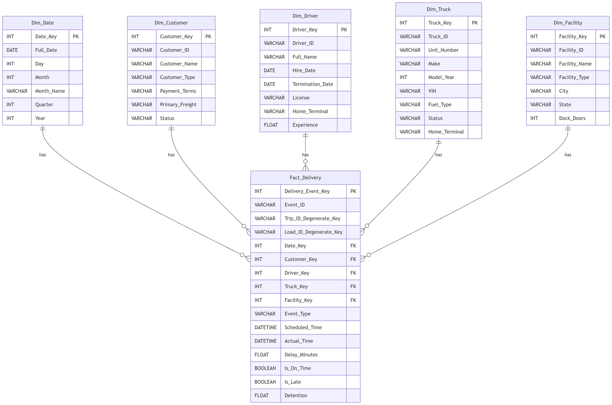
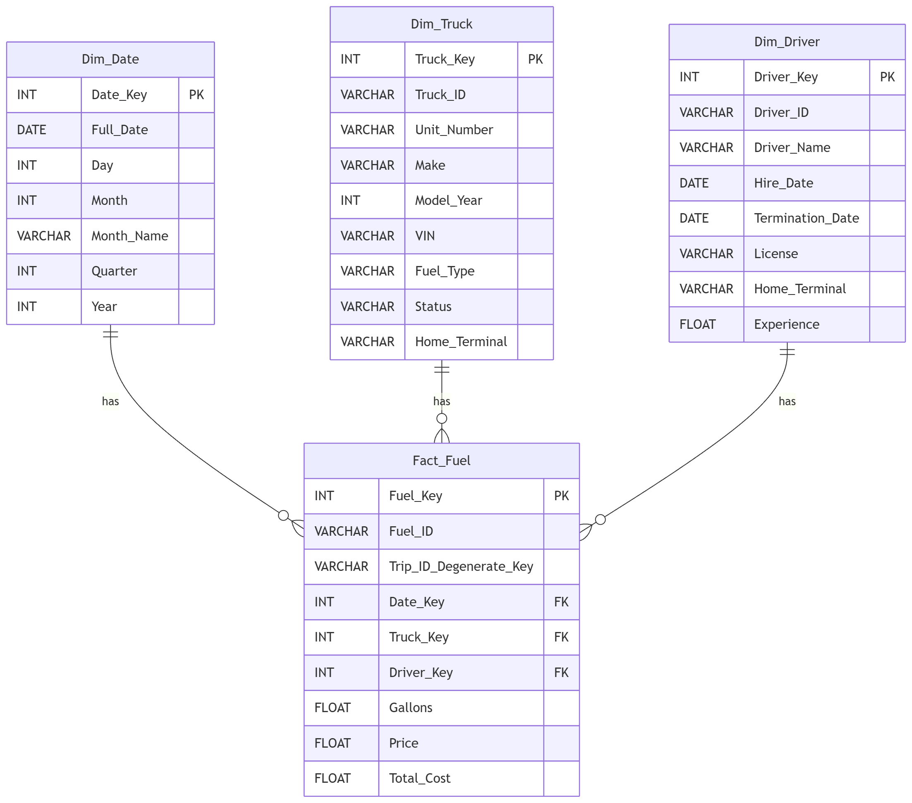
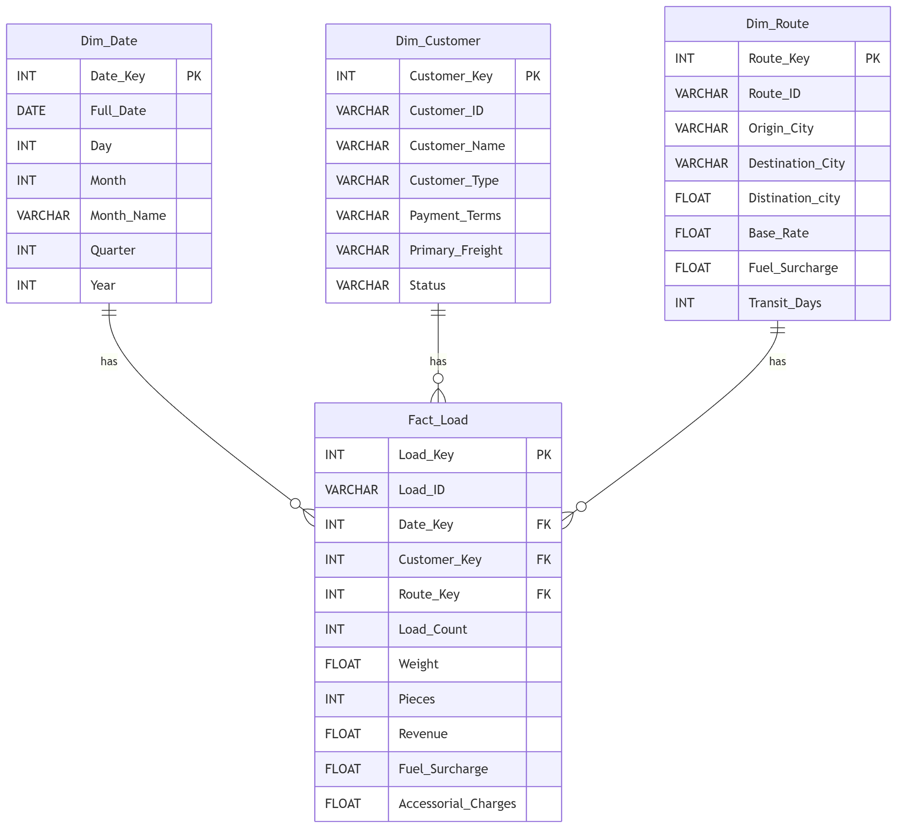
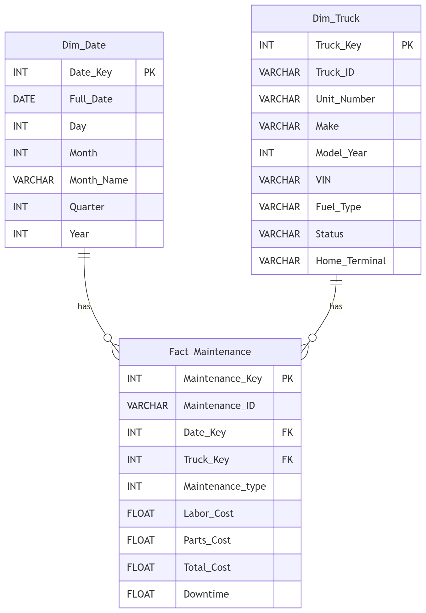
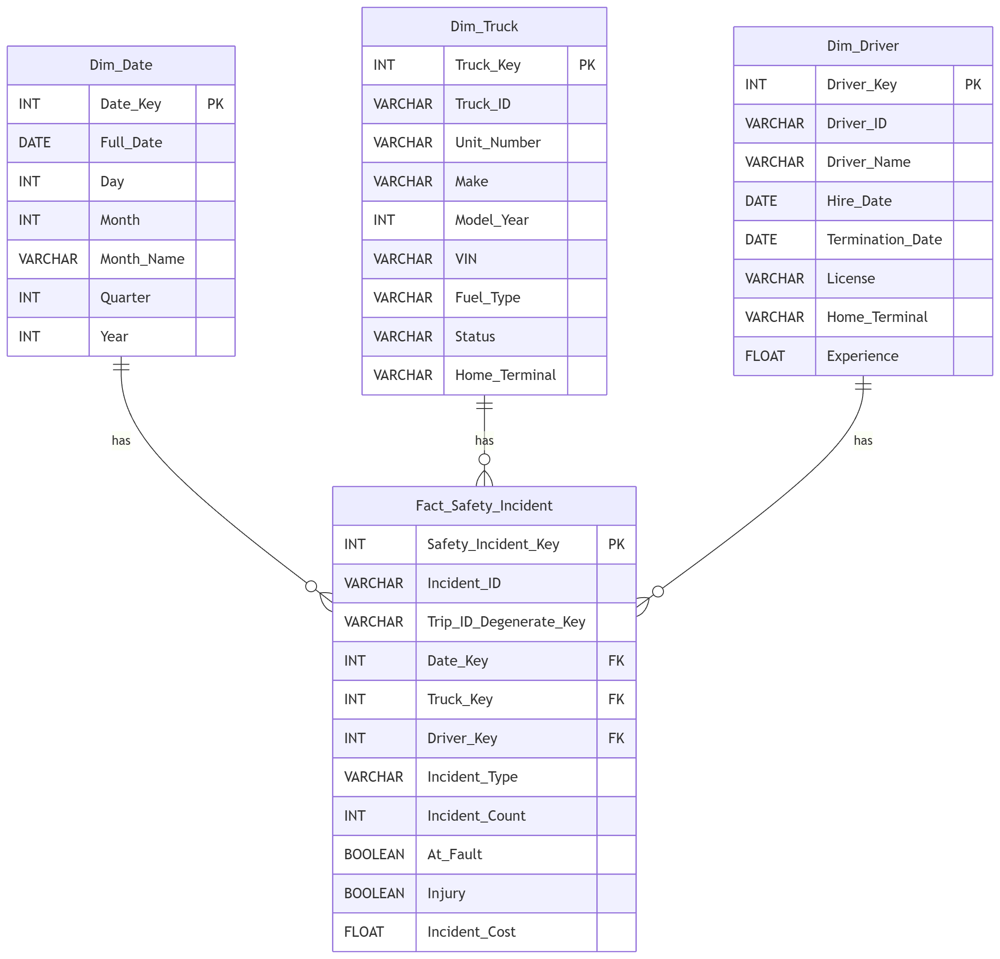
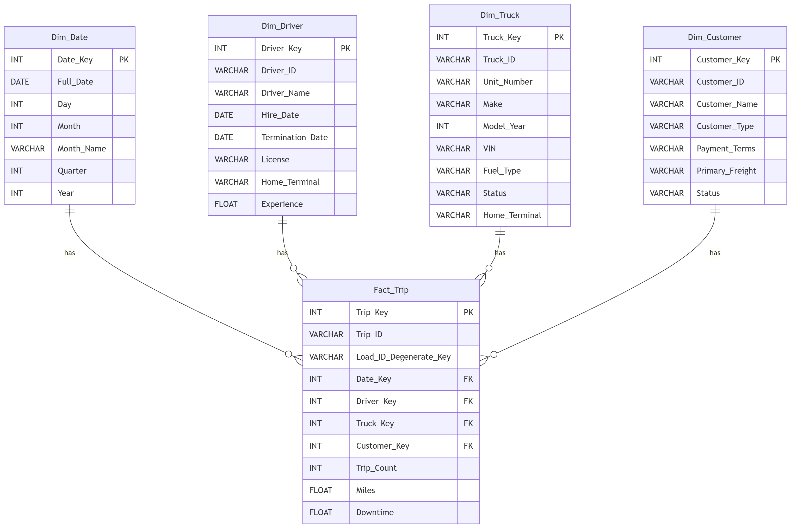

# DW_MiniProject
for do midterm project

# Introduce our group
Nattida Jantasopa 673020044-1

Chutima Boottanai 673020248-5

Jinrada Sai-Udta 673020489-3

Nanadda Rattanasri 673020490-8

Thitisuda Daengseeda 673020491-6

Phlapapon Kulto 673020626-9

## 🏗 Architecture & Design Principles

การออกแบบสถาปัตยกรรมข้อมูลในโปรเจกต์นี้ปฏิบัติตามมาตรฐาน **Kimball Data Warehousing Methodology**:

1. **Strict Star Schema Boundaries:** แยกตารางอย่างเด็ดขาดระหว่าง **Dimension Tables** และ **Fact Tables**
2. **No Fact-to-Fact Joins:** ป้องกันปัญหา *Fan Trap* และ *Double Counting* โดยยกเลิกการเชื่อมต่อความสัมพันธ์ระหว่าง Fact Tables โดยตรง แต่เชื่อมโยงผ่าน Shared (Conformed) Dimensions แทน
3. **Degenerate Dimensions:** คงค่ารหัสธุรกรรม เช่น `Trip_ID` และ `Load_ID` ไว้ใน Fact Tables เป็น Degenerate Keys เพื่อประโยชน์ในการ Traceability และ Drill-through Analysis
4. **Conformed Dimensions:** ใช้ `Dim_Date`, `Dim_Truck`, `Dim_Driver`, และ `Dim_Customer` ร่วมกันในหลาย Fact Tables เพื่อให้วิเคราะห์ข้อมูลข้ามโดเมนได้ (เช่น เปรียบเทียบรายได้ ค่าน้ำมัน และอุบัติเหตุต่อ Truck/Driver)

---
## Business Questions
1. รายได้รวมของบริษัทในแต่ละปีมีแนวโน้มอย่างไร และธุรกิจเติบโตขึ้นหรือไม่
2. เดือนหรือช่วงเวลาใดสร้างรายได้สูงที่สุด 
3. ลูกค้ารายใดสร้างรายได้ให้บริษัทมากที่สุด
4. เส้นทางใดมีปริมาณงานสูงที่สุด
5. รถบรรทุกคันใดมีประสิทธิภาพการใช้งานสูงสุดที่สุดและต่ำที่สุด เมื่อพิจารณาจากจำนวนเที่ยว
6. คนขับคนใดมีประสิทธิภาพในการทำงานสูงที่สุด เมื่อพิจารณาจากจำนวนเที่ยว
7. ต้นทุนน้ำมันของบริษัทในแต่ละเดือนและแต่ละปีเป็นอย่างไร
8. รถบรรทุกคันใดมีค่าใช้จ่ายค่าน้ำมันมากที่สุด
9. รถบรรทุกคันใดมีค่าใช้จ่ายในการซ่อมบำรุงสูงที่สุด
10. ค่าใช้จ่ายในการซ่อมบำรุงรวมของบริษัทในแต่ละปีเป็นเท่าไร
11. บริษัทมีอัตราการส่งสินค้าตรงเวลา คิดเป็นกี่เปอร์เซ็นต์
12. ศูนย์กระขายสินค้าใดมีจำนวนการส่งสินค้าล่าช้ามากที่สุด
13. ปีใดมีจำนวน Safety Incident มากที่สุด
14. คนขับรถคนใดเกิดอุบัติเหตุบ่อยที่สุด
15. Safety Incident ประเภทใดเกิดขึ้นบ่อยที่สุด
    
## Data Model Diagram

### ตารางระบบการทำธุรกรรมขนส่งและโลจิสติกส์ (OLTP)
Customers - ข้อมูลลูกค้าที่ใช้บริการขนส่งสินค้า

Loads - รายละเอียดภาระงานหรือรายการสินค้าที่ต้องทำการขนส่งในแต่ละรอบ

Routes - ข้อมูลเส้นทางการขนส่ง รวมถึงเมืองต้นทาง เมืองปลายทาง และระยะทาง

Trips - รายละเอียดการเที่ยววิ่งรถแต่ละครั้งเพื่อทำการจัดส่งสินค้า

Drivers - ข้อมูลประวัติและรายละเอียดของพนักงานขับรถ

Trucks - ข้อมูลรถบรรทุกที่ใช้ในระบบการขนส่ง

Trailers - ข้อมูลหางลากหรือส่วนพ่วงที่ใช้งานร่วมกับรถบรรทุก

Facilities - ข้อมูลศูนย์กระจายสินค้า สถานที่จัดส่ง หรือคลังสินค้า

Delivery_Events - บันทึกเหตุการณ์และสถานะต่างๆ ที่เกิดขึ้นในระหว่างขั้นตอนการจัดส่ง

Fuel_purchases - ประวัติการซื้อหรือเติมน้ำมันเชื้อเพลิงของรถบรรทุก

Safety_incidents - รายงานอุบัติเหตุหรือเหตุการณ์เกี่ยวกับความปลอดภัยที่เกิดขึ้นระหว่างการเดินทาง

Maintainance_record - บันทึกประวัติการซ่อมบำรุงและดูแลรักษารถบรรทุก

Driver_monthly_metrics - ข้อมูลสรุปตัววัดผลและประสิทธิภาพการทำงานรายเดือนของพนักงานขับรถ

Truck_utilization_metrics - ข้อมูลสรุปตัวเลขการใช้งานและประสิทธิภาพของรถบรรทุกรายเดือน
### รายละเอียดชุดข้อมูล 
ชุดข้อมูล Logistics Operations Database (2022–2024) บน Kaggle เป็นฐานข้อมูลจำลองการทำงานจริงของบริษัทรถบรรทุกขนาดใหญ่ (Class 8) ในสหรัฐฯ ครอบคลุมระยะเวลา 3 ปี รวมกว่า 85,000 records ใน 14 ตารางที่เชื่อมโยงกัน ออกแบบจากประสบการณ์จริง 12 ปีในสายงานโลจิสติกส์ เพื่อแก้ปัญหาความขาดแคลนชุดข้อมูลที่ซับซ้อนสมจริงโดยไม่ติดปัญหาความลับทางธุรกิจ (NDA)
### รายละเอียดข้อมูล 14 ตาราง 
1. กลุ่มข้อมูลหลักและทรัพยากร (Master & Entity Data) เก็บข้อมูลพื้นฐานของทรัพย์สิน บุคลากร ลูกค้า และเส้นทาง เพื่อใช้อ้างอิงในกิจกรรมอื่นๆ
#### Customers (ข้อมูลลูกค้า/ผู้ว่าจ้าง)

`Customer_id`: รหัสลูกค้า (PK)

`Customer_name` / `Customer_type`: ชื่อลูกค้า และประเภทธุรกิจลูกค้า

`Credit_terms_days`: ระยะเวลาเครดิตเทอมชำระเงิน (วัน)

`Primary_freight_type`: ประเภทสินค้าหลักที่ว่าจ้างขนส่ง

`Account_status`: สถานะบัญชีลูกค้า (เช่น Active, Inactive)

`Contract_starts_date`: วันเริ่มสัญญา

`Annual_revenue_potential`: ประมาณการรายได้ต่อปีจากลูกค้ารายนี้

#### Facilities (ศูนย์กระจายสินค้า/คลังสินค้า)
`Facility_id`: รหัสสถานที่ (PK)

`Facility_name`: ชื่อศูนย์/คลังสินค้า

`City / State`: เมือง และรัฐที่ตั้ง

`Latitude / Longitude`: พิกัดภูมิศาสตร์

`Dock_doors`: จำนวนช่องโหลดสินค้า

`Operating_hours`: เวลาทำการ

#### Routes (เส้นทางขนส่งมาตรฐาน)
`Route_id`: รหัสเส้นทาง (PK)

`Origin_city / Origin_state`: เมืองและรัฐต้นทาง

`Destination_city / Destination_state`: เมืองและรัฐปลายทาง

`Typical_distance_miles`: ระยะทางมาตรฐาน (ไมล์)

`Base_rate_per_mile`: ค่าบริการพื้นฐานต่อไมล์

`Fuel_surcharge_rate`: อัตราค่าธรรมเนียมน้ำมันผันแปร

`Typical_transit_days`: ระยะเวลาเดินทางมาตรฐาน (วัน)

#### Drivers (ข้อมูลพนักงานขับรถ)
`Driver_id`: รหัสพนักงานขับรถ (PK)

`First_name / Last_name`: ชื่อ-นามสกุล

`Hire_date / Termination_date`: วันเข้าทำงาน และวันออก (ถ้ามี)

`License_number / License_state`: เลขใบขับขี่ และรัฐที่ออกใบอนุญาต

`Date_of_birth`: วันเกิด

`Home_terminal`: ศูนย์ปฏิบัติการหลักที่สังกัด

`Employment_status`: สถานะการทำงาน

#### Trucks (ข้อมูลรถบรรทุก)
`Truck_id`: รหัสรถบรรทุก (PK)

`Unit_number`: หมายเลขประจำรถ

`Make / Model_year`: ยี่ห้อ และปีที่ผลิต

`Vin`: เลขตัวรถ (Vehicle Identification Number)

`Acquisition_date / Acquisition_mileage`: วันที่จัดซื้อ และเลขไมล์ ณ วันซื้อ

`Fuel_type / Tank_capacity_gallons`: ประเภทน้ำมัน และความจุถังน้ำมัน (แกลลอน)

`Status`: สถานะรถ (เช่น พร้อมใช้งาน, ซ่อมบำรุง)

#### Trailers (ข้อมูลหางลาก/ตู้พ่วง)
`Trailer_id`: รหัสหางลาก (PK)

`Trailer_number / Trailer_type`: หมายเลขหางลาก และประเภทตู้ (เช่น Dry Van, Reefer)

`Length_feet`: ความยาวตู้ (ฟุต)

`Model_year / Vin`: ปีที่ผลิต และเลขตัวถัง

`Acquisition_date`: วันที่จัดซื้อ

`Status / Current_location`: สถานะใช้งาน และสถานที่อยู่ปัจจุบัน

### 3. กลุ่มรายการปฏิบัติการและค่าใช้จ่าย (Transactional Data) บันทึกเหตุการณ์ที่เกิดขึ้นจริงในการทำงานแต่ละวัน
#### Loads (ใบสั่งงาน/ภาระสินค้า)
`Load_id`: รหัสใบสั่งงาน (PK)

`Load_date`: วันที่รับออเดอร์

`Load_type`: ประเภทการบรรทุก (เช่น Full Truckload - FTL)

`Weight_lbs / Pieces`: น้ำหนัก (ปอนด์) และจำนวนชิ้นสินค้า

`Revenue / Fuel_surcharge / Accessorial_charges`: ค่าขนส่งหลัก, ค่าธรรมเนียมน้ำมัน, และค่าบริการเพิ่มเติม

#### Trips (เที่ยววิ่งจริง)
`Trip_id`: รหัสเที่ยววิ่ง (PK)

`Dispatch_date`: วันที่ปล่อยรถออกปฏิบัติงาน

`Actual_distance_miles / Actual_duration_hours`: ระยะทางจริง (ไมล์) และเวลาที่ใช้จริง (ชั่วโมง)

`Fuel_gallons_used / Average_mpg`: ปริมาณน้ำมันที่ใช้ และอัตราสิ้นเปลืองเฉลี่ย (ไมล์/แกลลอน)

`Idle_time_hours`: เวลาที่จอดสตาร์ทเครื่องทิ้งไว้

`Trip_status`: สถานะเที่ยววิ่ง (เช่น Completed, In Transit)

#### Delivery_events (สถานะจุดรับ-ส่งสินค้า)
`Event_id`: รหัสเหตุการณ์ (PK)

`Event_type`: ประเภทเหตุการณ์ (เช่น Pickup, Delivery)

`Scheduled_datetime / Actual_datetime`: เวลาที่นัดหมาย และเวลาที่ไปถึงจริง

`Detention_minutes`: เวลาที่ต้องรอคอย ณ จุดรับส่ง (นาที)

`On_time_flag`: ตัวชี้วัดการตรงต่อเวลา (Yes/No)

`Location_cit`y: เมืองที่เกิดเหตุการณ์

#### Fuel_purchases (ประวัติการเติมน้ำมัน)
`Fuel_purchases_id`: รหัสการซื้อน้ำมัน (PK)

`Purchase_date`: วันที่ซื้อ

`Location_city / Location_state`: สถานีบริการน้ำมัน (เมือง/รัฐ)

`Gallons / Price_per_gallons`: จำนวนแกลลอน และราคาต่อแกลลอน

`Total_cost`: ค่าใช้จ่ายน้ำมันรวม

`Maintenance_records`: (ประวัติการซ่อมบำรุง)

`Maintenance_id`: รหัสการซ่อมบำรุง (PK)

`Maintenance_date / Maintenance_type`: วันที่ซ่อม และประเภทการซ่อม (เช่น สี่งซ่อมตามระยะ Preventive, ซ่อมฉุกเฉิน)

`Odometer_reading`: เลขไมล์ขณะเข้าซ่อม

`Labor_hours / Labor_cost / Parts_cost / Total_cost`: ชั่วโมงแรงงานช่าง, ค่าแรง, ค่าอะไหล่ และราคารวม

`Facility_location`: สถานที่ซ่อมบำรุง

#### Safety_incidents (บันทึกอุบัติเหตุและความเสี่ยง)
`Incident_id`: รหัสเหตุการณ์อุบัติเหตุ (PK)

`Incident_date / Incident_type`: วันที่เกิดเหตุ และประเภทอุบัติเหตุ

`Location_city`: เมืองที่เกิดเหตุ

`At_fault_flag`: ตัวระบุความผิด (ใช่/ไม่ใช่)

`Injury_flag`: ตัวระบุการบาดเจ็บ (มี/ไม่มี)

### 4. กลุ่มข้อมูลสรุปตัววัดผล (Aggregated Analytics Data) ตารางคำนวณสรุปรายเดือนเพื่อใช้ทำ KPI แดชบอร์ด และรายงานผู้บริหาร
#### Driver_monthly_metrics (สรุปผลงานคนขับรายเดือน)

`Driver_id + Month`: รหัสพนักงาน และเดือนที่สรุป (Composite Keys)

`Trips_completed / Total_miles`: จำนวนเที่ยววิ่งที่สำเร็จ และระยะทางรวม

`Total_revenue`: รายได้รวมที่คนขับทำได้

`Average_mpg / Total_fuel_gallons`: ประสิทธิภาพประหยัดน้ำมันเฉลี่ย และปริมาณน้ำมันรวม

`On_time_delivery_rate`: อัตราการส่งสินค้าตรงเวลา (%)

`Average_idle_hours`: เวลาจอดติดเครื่องเฉลี่ย

#### Truck_utilization_metrics (สรุปการใช้งานรถบรรทุกรายเดือน)
`Truck_id + Month`: รหัสรถบรรทุก และเดือนที่สรุป (Composite Keys)

`Trips_completed / Total_miles / Total_revenue`: งานรวม, ระยะทางรวม, รายได้รวมของรถคันนั้น

`Average_mpg`: อัตราสิ้นเปลืองน้ำมันเฉลี่ยของรถ

`Maintenance_events / Maintenance_cost`: จำนวนครั้งเข้าซ่อม และค่าซ่อมบำรุงรวม

`Downtime_hours`: จำนวนชั่วโมงที่รถต้องจอดซ่อม (ใช้งานไม่ได้)

`Utilization_rate`: อัตราการถูกนำไปใช้งานจริงเทียบกับเวลาทั้งหมด (%)

### การดำเนินงานของธุรกิจ Logistics
Step 1: ตั้งต้นจากลูกค้าและการจองงาน (Demand Generation)
เริ่มที่ Customers สั่งงานเกิดเป็น Loads ผ่าน Routes และ Facilities

Step 2: การจัดสรรทรัพยากร (Execution Setup)
อธิบายว่า Loads ถูกแปลงเป็น Trips โดยจับคู่ทรัพยากร 3 อย่างเข้าด้วยกันคือ Drivers + Trucks + Trailers

Step 3: บันทึกเหตุการณ์ระหว่างทาง (Operational Events & Expenses)
การวิ่งรถสร้างข้อมูล 3 ด้าน: เวลาจัดส่ง (Delivery Events), ต้นทุนผันแปร (Fuel Purchases), และความเสี่ยง (Maintenance Records & Safety Incidents)

Step 4: การวัดผลทางธุรกิจ (Business Intelligence Output)
สรุปข้อมูลธุรกรรมทั้งหมดกลับมาเป็น Driver Monthly Metrics และ Truck Utilization Metrics เพื่อตอบโจทย์บริหาร เช่น การวัด Fleet Utilization (เฉลี่ย 65%) หรือ Driver Turnover Rate (15%)

## ETL Process
กระบวนการ ETL (Extract, Transform, Load) ในชุดโค้ด SQL ข้างต้น ทำหน้าที่แปลงข้อมูลการขนส่งและโลจิสติกส์ดิบจากระบบต้นทาง (fivegexpress) ให้กลายเป็น Data Warehouse  ในรูปแบบ Star Schema เพื่อรองรับการนำไปทำ Dashboard และวิเคราะห์ข้อมูลเชิงลึก

Phase 1: Extract (การดึงข้อมูลดิบเข้า Staging Schema)
ในขั้นตอนแรก ระบบจะทำการคัดลอกข้อมูลดิบแบบ 1:1 จากตารางต้นทางทั้ง 12 ตารางเข้ามาพักไว้ที่ staging schema
- การสร้าง Ingestion Timestamp: บันทึกเวลาที่ดึงข้อมูลเข้าสู่ระบบด้วย current_localtimestamp() เพื่อใช้อ้างอิงย้อนหลังว่าข้อมูลถูกดึงเข้ามา ณ เวลาใด
- การแยก Layer (Decoupling): การคัดลอกข้อมูลมาไว้ที่ staging ก่อน ช่วยลดภาระการ Query โดยตรงไปที่ระบบหลัก (Production Database) และป้องกันไม่ให้กระบวนการ Transform ส่งผลกระทบต่อประสิทธิภาพของระบบต้นทาง
  
Phase 2: Transform & Load Dimensions (การแปลงและจัดเก็บข้อมูลมิติ)
ขั้นตอนนี้เป็นการนำข้อมูลจาก staging มาทำความสะอาด ปรับโครงสร้าง และโหลดลงตารางมิติ (Dimension Tables) เพื่อใช้เป็นบริบทในการอธิบายข้อมูล
- การจัดการรูปแบบวันที่ (Date Standardization):
   - ข้อมูลวันที่จากระบบต้นทางมักมีรูปแบบที่ไม่แน่นอน (เช่น %m/%d/%Y %H:%M:%S, %Y-%m-%d, หรือ %m/%d/%Y)
   - โค้ดใช้ TRY_STRPTIME ร่วมกับ COALESCE เพื่อลองแปลงข้อความตามฟอร์แมตต่างๆ จนกว่าจะสำเร็จ แล้วปรับ Type ให้เป็น DATE ที่ถูกต้อง
- การคัดกรองข้อมูลซ้ำ (Deduplication):
จัดกลุ่มข้อมูลด้วย ROW_NUMBER() OVER (PARTITION BY <id_column>) และเลือกเฉพาะรายการแรก (WHERE row_num = 1) เพื่อให้มั่นใจว่าข้อมูล Master แต่ละชิ้นมีเพียง Record เดียว
- การสร้าง Surrogate Keys:
รันลำดับตัวเลขใหม่ด้วย ROW_NUMBER() OVER (ORDER BY <id_column>) เพื่อสร้าง Primary Key ประจำ Data Warehouse (เช่น truck_key, driver_key, customer_key) ซึ่งช่วยเพิ่มประสิทธิภาพการ Join และทำ Indexing
- การสร้าง ตารางมิติเวลา (dim_date):
ใช้ generate_series สร้างลำดับวันที่ต่อเนื่องตั้งแต่วันที่ 1 ม.ค. 2022 ถึง 31 ธ.ค. 2024
คำนวณ Attribute ทางเวลาเพิ่ม เช่น ปี, ไตรมาส, เดือน, ชื่อวัน, และสถานะวันหยุดเสาร์-อาทิตย์ (weekend) พร้อมสร้าง date_key ในรูปแบบตัวเลข (YYYYMMDD)

Phase 3: Transform & Load Facts (การแปลงและจัดเก็บข้อมูลข้อเท็จจริง)
ขั้นตอนนี้เป็นการนำข้อมูลธุรกรรม (Transactions) หรือเหตุการณ์ที่เกิดขึ้นจริงในธุรกิจ มาเชื่อมโยงกับตารางมิติ แล้วบันทึกลงตารางข้อเท็จจริง (Fact Tables)
- การรวมข้อมูลจากหลายแหล่ง (Data Consolidation):
ในตาราง fact_trips_operations มีการนำข้อมูลการวิ่งรถ (stg_trips), รายละเอียดสินค้า (stg_loads), และสถานะการส่งมอบ (stg_delivery_events) มาประกอบรวมกันเป็น Record เดียวกัน
- การเชื่อมโยงมิติ (Dimension Lookup via JOIN):
ทำการ LEFT JOIN ตารางมิติที่สร้างไว้ใน Phase 2 (dim_trucks, dim_drivers, dim_customers ฯลฯ) โดยเปลี่ยนจากการใช้ Business Key เดิม (เช่น truck_id) มาเก็บเป็น Surrogate Key (truck_key) แทน
- การจัดเตรียมตัววัดทางธุรกิจ (Business Metrics & Keys):
   - คำนวณคอร์สและตัวเลขทางสถิติ เช่น รายได้ (revenue), ค่าใช้จ่ายน้ำมัน (fuel_cost), ระยะทาง (actual_distance_miles), และค่าปรับการจอดรอ (detention_minutes)
   - แปลงวันที่เกิดเหตุการณ์ให้เป็น date_key เพื่อเชื่อมเข้ากับ dim_date สำหรับการวิเคราะห์ตามช่วงเวลา

## Data Cube Diagram

    

## Data Warehouse Database

**`dim_customers`** คือตารางมิติลูกค้าที่ทำหน้าที่เก็บโปรไฟล์และบริบททางธุรกิจของคู่ค้า เช่น ชื่อ ประเภทลูกค้า ระยะเวลาให้เครดิตชำระเงิน (`credit_terms_days`) ประเภทการขนส่งหลัก สถานะบัญชี และประมาณการรายได้ต่อปี (`annual_revenue_potential`) โดยมีการแปลงฟอร์แมตวันที่เริ่มสัญญา กำจัดข้อมูลซ้ำด้วย `customer_id` และสร้าง `customer_key` เป็น Surrogate Key สำหรับเชื่อมโยงกับตาราง Fact ในการวิเคราะห์พฤติกรรมและรายได้แยกตามกลุ่มลูกค้า

**`dim_date`** คือตารางมิติเวลาปฏิทินกลางที่สร้างขึ้นจากการสร้างลำดับอนุกรมวันที่ตั้งแต่ปี 2022 ถึง 2024 โดยคำนวณและสกัดองค์ประกอบเชิงเวลา ได้แก่ ปี ไตรมาส เดือน ชื่อเดือน ชื่อวัน และการระบุว่าเป็นวันหยุดเสาร์-อาทิตย์ (`weekend`) พร้อมสร้าง `date_key` ในรูปแบบตัวเลข (`YYYYMMDD`) เพื่อใช้เป็นคีย์กลางสำหรับตาราง Fact ทุกตารางในการวิเคราะห์เปรียบเทียบข้อมูลตามมิติเวลาได้อย่างมีประสิทธิภาพ

**`dim_drivers`** คือตารางมิติพนักงานขับรถที่รวบรวมประวัติและคุณลักษณะของพนักงาน เช่น ชื่อ-นามสกุล วันเริ่มงาน วันลาออก สถานะการทำงาน ประเภทใบขับขี่ (`cdl_class`) ประสบการณ์ทำงานเป็นปี วันเกิด และสถานีประจำการ (`home_terminal`) โดยจัดการฟอร์แมตวันที่และคัดกรองข้อมูลซ้ำผ่าน `driver_id` เพื่อสร้าง `driver_key` ใช้สำหรับประเมินประสิทธิภาพ การทำงาน และความปลอดภัยของพนักงานแต่ละคน

**`dim_facilities`** คือตารางมิติคลังสินค้าและศูนย์กระจายสินค้าที่จัดเก็บข้อมูลสถานที่ ได้แก่ ชื่อ ประเภทคลังสินค้า เมือง รัฐ พิกัดทางภูมิศาสตร์ (ละติจูดและลองจิจูด) ชั่วโมงการทำงาน และจำนวนช่องโหลดสินค้า (`dock_doors`) โดยสร้าง `facility_key` จาก `facility_id` ที่ผ่านการคัดกรองข้อมูลซ้ำ เพื่อนำไปใช้เป็นมิติในการวิเคราะห์ประสิทธิภาพของจุดรับ-ส่งสินค้าและการบริหารจัดการพื้นที่โหลดสินค้า

**`dim_routes`** คือตารางมิติเส้นทางเดินรถที่เก็บข้อมูลมาตรฐานของแต่ละเส้นทางขนส่ง ได้แก่ เมืองและรัฐต้นทาง เมืองและรัฐปลายทาง ระยะทางโดยประมาณ (`typical_distance_miles`) อัตราค่าบริการพื้นฐานต่อไมล์ อัตราค่าธรรมเนียมน้ำมัน และระยะเวลาเดินทางโดยประมาณ โดยใช้ `route_key` เป็นคีย์จำลองเพื่อประเมินความคุ้มค่าและเปรียบเทียบประสิทธิภาพเทียบกับเส้นทางมาตรฐาน

**`dim_trailers`** คือตารางมิติหางลากหรือรถพ่วงที่จัดเก็บคุณลักษณะเฉพาะของอุปกรณ์ เช่น หมายเลขหางลาก ประเภทหางลาก ความยาว หมายเลข VIN วันที่ได้มา สภาพและสถานะการใช้งานปัจจุบัน รวมถึงพิกัดตำแหน่ง โดยกำจัดข้อมูลซ้ำและสร้าง `trailer_key` สำหรับติดตามการใช้งาน อัตราการจัดเก็บ และการกระจายตัวของอุปกรณ์ขนส่ง

**`dim_trucks`** คือตารางมิติหัวรถบรรทุกที่เก็บข้อมูลเฉพาะของยานพาหนะ เช่น ยี่ห้อ ปีที่ผลิต หมายเลข VIN วันที่และระยะทางเมื่อได้รถมา ประเภทน้ำมันเชื้อเพลิง ความจุถังน้ำมัน สถานะรถ และสถานีประจำการ โดยผูกคีย์จำลอง `truck_key` เพื่อใช้เป็นศูนย์กลางในการเชื่อมโยงกับข้อมูลการใช้น้ำมัน การซ่อมบำรุง และอุบัติเหตุของรถแต่ละคัน

**`fact_fuel_purchases`** คือตารางข้อเท็จจริงการซื้อน้ำมันเชื้อเพลิงที่บันทึกเหตุการณ์การเติมน้ำมันแต่ละครั้ง ได้แก่ วันที่ซื้อ เมือง รัฐ ปริมาณแกลลอน และต้นทุนรวม (`fuel_cost`) โดยเชื่อมโยง `date_key` กับมิติเวลา และ `truck_key` กับมิติรถบรรทุก พร้อมใช้เทคนิค Partitioning ตามวันที่ซื้อ เพื่อให้ระบบสามารถวิเคราะห์พฤติกรรมการใช้น้ำมันและควบคุมต้นทุนพลังงานได้อย่างรวดเร็ว

**`fact_maintenance_records`** คือตารางข้อเท็จจริงการซ่อมบำรุงที่บันทึกประวัติและค่าใช้จ่ายในการดูแลรักษารถ เช่น ประเภทการซ่อม เลขไมล์ ชั่วโมงแรงงาน ค่าแรง ค่าอะไหล่ ค่าซ่อมรวม (`maintenance_cost`) และเวลาที่รถต้องจอดเสีย (`downtime_hours`) โดยเชื่อมโยงกับ `date_key` และ `truck_key` พร้อมจัดแบ่งส่วนข้อมูล (Partitioning) ตามวันที่ซ่อม เพื่อใช้ติดตามความสมบูรณ์ของยานพาหนะและควบคุมค่าใช้จ่ายการซ่อมบำรุง

**`fact_safety_incidents`** คือตารางข้อเท็จจริงอุบัติเหตุและความปลอดภัยที่บันทึกเหตุการณ์ความไม่ปลอดภัยที่เกิดขึ้น โดยเก็บตัววัดเชิงปริมาณ ได้แก่ มูลค่าความเสียหายของตัวรถ สินค้า และยอดเงินเรียกร้องประกัน พร้อมแฟล็กระบุความผิดและการป้องกันได้ โดยเชื่อมโยงมิติเวลา รถบรรทุก และพนักงานขับรถผ่าน `date_key`, `truck_key` และ `driver_key` เพื่อประเมินความเสี่ยงและวัดผลด้านความปลอดภัยในการทำงาน

**`fact_trips`** คือตารางข้อเท็จจริงหลักของการปฏิบัติงานขนส่งที่รวมข้อมูลการวิ่งเที่ยวส่งสินค้า ข้อมูลโหลดสินค้า และเหตุการณ์การจัดส่งเข้าด้วยกัน บันทึกตัววัดสำคัญ เช่น รายได้ น้ำหนักสินค้า ระยะทางจริง ปริมาณน้ำมันที่ใช้ อัตราสิ้นเปลือง (`average_mpg`) เวลาจอดนิ่ง เวลาคอย และแฟล็กการส่งตรงเวลา โดยเชื่อมโยงมิติเวลา รถบรรทุก หางลาก ลูกค้า คลังสินค้า และพนักงานขับรถ เพื่อเป็นศูนย์กลางในการวิเคราะห์ประสิทธิภาพและผลตอบแทนของการขนส่งอย่างครบวงจร
  
## Interactive Dashboard

